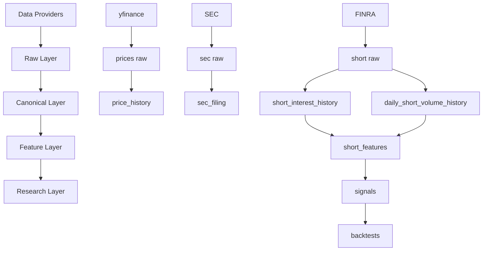

# 📈 stock-quant-oop


---

<details>
<summary><strong>🚀 Overview</strong></summary>

Quant research pipeline with:
- SQL-first architecture
- Point-in-time safe data model
- Incremental daily pipelines
- Large-scale FINRA + market data

</details>

---

<details>
<summary><strong>🏗️ Architecture Diagram</strong></summary>



</details>

---

<details>
<summary><strong>📊 SQL Schema (simplified)</strong></summary>

```sql
CREATE TABLE price_history (
    symbol VARCHAR,
    date DATE,
    close DOUBLE
);

CREATE TABLE sec_filing (
    company_id VARCHAR,
    filing_date DATE,
    form_type VARCHAR
);

CREATE TABLE finra_short_interest_history (
    symbol VARCHAR,
    settlement_date DATE,
    short_interest BIGINT
);

CREATE TABLE daily_short_volume_history (
    symbol VARCHAR,
    trade_date DATE,
    short_volume BIGINT
);

CREATE TABLE short_features_daily (
    symbol VARCHAR,
    as_of_date DATE,
    short_ratio DOUBLE
);
```

</details>

---

<details>
<summary><strong>⚙️ Run Pipeline</strong></summary>

python3 cli/run_daily_pipeline.py

</details>

---

<details>
<summary><strong>⏰ Cron</strong></summary>

0 17 * * * cd /home/marty/stock-quant-oop && python3 cli/run_daily_pipeline.py >> logs/cron.log 2>&1

</details>

---

## 🧠 Principles

- SQL-first transformations
- No look-ahead bias
- No survivor bias
- Canonical history always wins

---

## 👤 Author
astronometria

